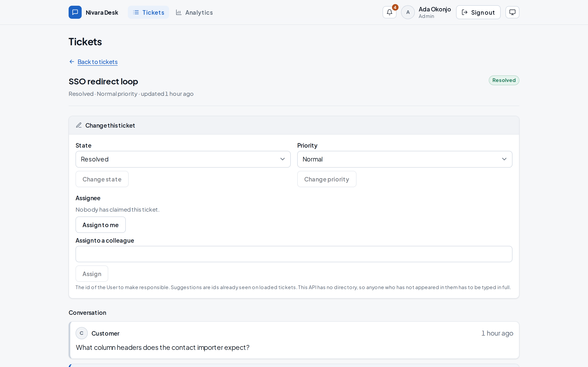
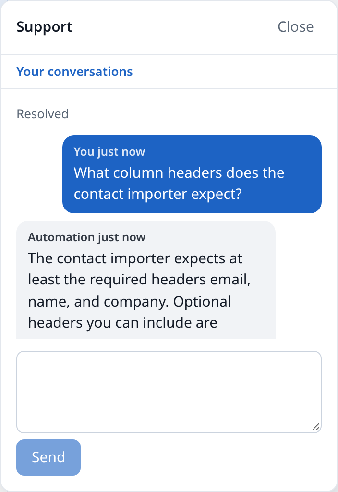

# nivara-web

The four front ends of [Nivara Desk](https://nivara-landing-iota.vercel.app) — the customer
**Portal**, the agent **Dashboard**, the embeddable **Widget**, and **Analytics** — and one typed
client shared between them. Next.js 15, React 19, TypeScript, Tailwind v4.

What separates the four is which credential they hold, not which pages they render. The system is
multitenant and this application is *implicitly* tenant-scoped: the tenant is resolved server-side
from the token on every request and is never a value the client holds, passes, or puts in a URL.

**[Live](https://nivara-web-nextjs.vercel.app)** · demo sign-in is seeded, see below.

<picture>
  <source media="(prefers-color-scheme: dark)" srcset="docs/img/ticket.dark.png">
  
</picture>

## Running it

```bash
npm install
cp .env.example .env.local   # holds the deployed API's URL
npm run dev
```

`NEXT_PUBLIC_API_URL` is the only input that points this application at a backend, and it
configures all three of them:

| | |
|---|---|
| HTTP base | the URL itself |
| Real-time origin | that URL plus `/rt`, never a second variable that could disagree with the first |
| Type generation | that URL plus `/openapi.json` |

There is no committed default. Unset, nothing starts and nothing builds —
[`src/config/api.ts`](src/config/api.ts) names the missing variable rather than falling back to a
value nobody chose, and a committed `.env` would be that value. Point it at another Nivara Desk API
and nothing else in this repository changes.

To run against a local API instead, bring up
[nivara-api-nestjs](https://github.com/rishabh0111/nivara-api-nestjs) with `docker compose up` and
set `NEXT_PUBLIC_API_URL=http://localhost:3000`.

## The demo sign-in

Sign-in takes the tenant id as a required field, so all three values are needed:

| | |
|---|---|
| Workspace ID | `5eed0000-0000-4000-8000-000000000001` |
| Email | `admin@meridian.test` |
| Password | `nivara-demo-password` |

They are seeded demo data, printed by the API's `npm run db:seed`, and public by construction.

## The four surfaces

| | Holds | Does |
|---|---|---|
| [`/portal`](https://nivara-web-nextjs.vercel.app/portal) | A Contact, signed in with a password | Raise a ticket, read the replies, answer them. |
| [`/dashboard`](https://nivara-web-nextjs.vercel.app/dashboard) | A User with the agent or admin role | Work a filtered, cursor-paginated queue; reply; leave internal notes; move things along. |
| [`/widget`](https://nivara-web-nextjs.vercel.app/widget) | An anonymous Visitor, on somebody else's page | Ask a question from a tenant's own site, with no account first. |
| [`/dashboard/analytics`](https://nivara-web-nextjs.vercel.app/dashboard/analytics) | A User holding `analytics:read` | Four rates, two percentiles, and what an empty cohort is not. |

The Widget is a **separate bundle** that mounts inside a shadow root in the host page's own
document, so a tenant's stylesheet cannot reach in and its own cannot leak out. It is demonstrated
on a deliberately hostile page served from a different origin:

| | |
|---|---|
| [Demo host](https://rishabh0111.github.io/nivara-web-nextjs/) | Bootstraps the showcase tenant. Ask it something the help centre covers and it answers. |
| [The isolation page beside it](https://rishabh0111.github.io/nivara-web-nextjs/isolation/) | Same origin, same script, one attribute apart — a different tenant, and it cannot answer at all. |

<picture>
  <source media="(prefers-color-scheme: dark)" srcset="docs/img/widget.panel.dark.png">
  
</picture>

## Generated types

The typed client's types come from the API's OpenAPI document, never from anyone's hand.

```bash
npm run api:types   # regenerate src/api/generated/openapi.ts
npm run api:drift   # fail if the committed types and the API disagree
```

Generation emits **types only** — no generated runtime, no template overrides. The request layer is
hand-written middleware a reviewer can read. The generated file is committed so regenerating
produces a diff that reads as drift rather than churn. `api:drift` runs in CI and on a daily
schedule, because the API drifting is a property of the server changing rather than of anyone
pushing a commit.

## Checks

```bash
npm run typecheck
npm run lint
npm test          # mocked; reaches no network
npm run build
```

One path is not mocked: `npm run test:e2e` signs in against the **deployed** API, renews, opens a
ticket, replies, and waits for the reply to arrive live. It is opt-in — unconfigured, it skips and
names the missing variable — and it is the proof that the mocked suite is testing the right thing.
See [`e2e/README.md`](e2e/README.md).

## Where the reasoning is

The decisions behind the awkward parts — why authenticated views are not server-rendered, why a
live queue is announced rather than refetched under a reader, why the Widget renders in the host
document, why a gap discards and re-reads — are in [`docs/adr/`](docs/adr), one file each.
[`CONTEXT.md`](CONTEXT.md) is the vocabulary the code is written in.
[`docs/deployment.md`](docs/deployment.md) covers the deployed topology and the demo hosts.
